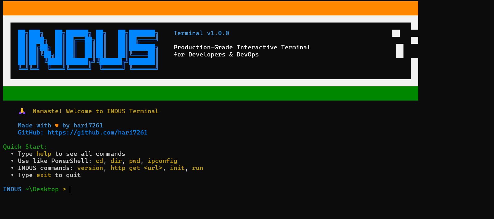
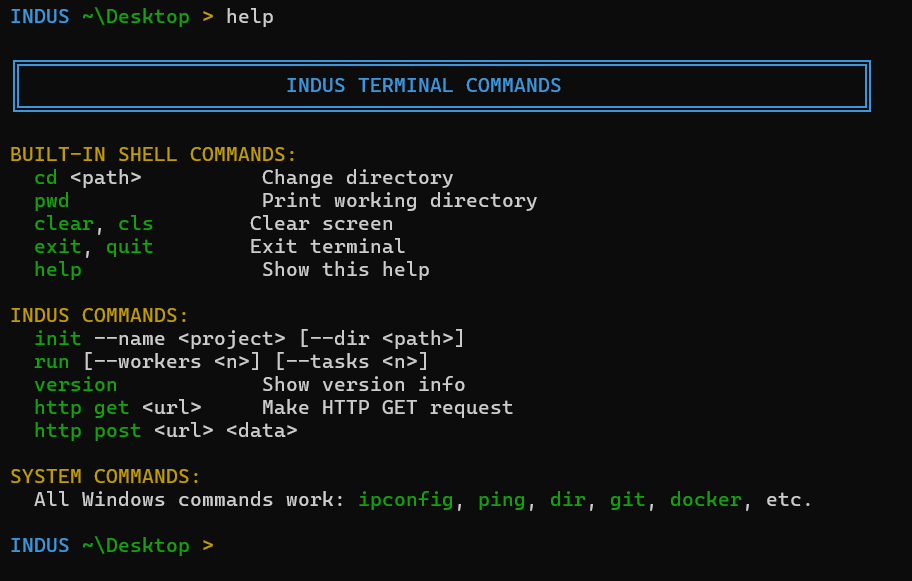

# INDUS Terminal 🇮🇳

<div align="center">



**Production-grade interactive terminal for API orchestration, developer tooling, and concurrent workloads.**  
Built with zero external dependencies — pure Go standard library.

[](https://github.com/hari7261/INDUS/releases/latest)
[](https://go.dev/)
[](https://www.microsoft.com/windows)
[](LICENSE)

[Install](#-installation) • [Features](#-features) • [Usage](#-usage) • [Pipelines](#-internal-pipelines) • [Colors](#-prompt-colors) • [Build from Source](#-build-from-source)

</div>

---

## 🚀 Installation

### One-click installer (like Git)

1. Go to **[Releases → Latest](https://github.com/hari7261/INDUS/releases/latest)**
2. Download **`indus-setup-vX.Y.Z-windows-amd64.exe`**
3. Run it — wizard installs INDUS and adds it to your PATH
4. Open any new terminal and type `indus`

> The download link above **always points to the latest version** — no manual URL updates needed.

### What the installer does

| | |
|-|-|
| Files | `%LOCALAPPDATA%\INDUS\indus.exe` |
| PATH | Added at user level (no admin needed) |
| Desktop shortcut | **INDUS Terminal** |
| Start Menu | **INDUS Terminal** |
| Right-click | **"Open INDUS Terminal here"** on any folder |
| Uninstall | Registered in **Apps & Features** |

### Portable (no installer)

Download `indus.exe` from [Releases](https://github.com/hari7261/INDUS/releases/latest) and double-click. Done.

---

## ✨ Features

### 🆕 What's New in v1.5.3

**Major Production Enhancements:**
- ✅ **Full System Command Passthrough** - Run ANY Windows/system command directly (git, docker, python, npm, etc.)
- ✅ **Development Toolchain Detection** - Automatically detect and verify 30+ dev tools (Python, Node.js, Go, Rust, Java, and more)
- ✅ **Enhanced Error Handling** - Fixed critical bugs in environment variable management
- ✅ **Symlink Loop Protection** - Safe filesystem operations with automatic loop detection
- ✅ **Port Validation** - Proper TCP port range validation (1-65535)
- ✅ **Improved Console** - Better console initialization and independence
- ✅ **GUI-Only Windows Release** - Windows artifacts now ship as a single `indus.exe` GUI-first executable
- ✅ **60 Built-in Commands** - Two new commands: `tools scan` and `tools check`
- ✅ **Production Ready** - All known issues resolved, comprehensive bug fixes

**Bug Fixes:**
- Fixed environment module error silencing
- Fixed package audit logic issues
- Added proper error propagation throughout codebase
- Improved filesystem operation safety

---

### 🖥️ Interactive Shell



- Indian flag ASCII banner (Saffron → White → Green)
- Smart prompt: `INDUS ~/Documents >`
- Full Windows shell fallback — every system command works
- ANSI color support auto-enabled on startup

### 🎨 Prompt Colors (10 themes)

Change the prompt accent color any time:

```
color r   →  Red        color m   →  Magenta
color g   →  Green      color w   →  White
color b   →  Blue       color o   →  Orange
color y   →  Yellow     color p   →  Pink
color c   →  Cyan       color d   →  Default (Cyan)
```

Run `color` with no argument to see all swatches with a live preview.

### 🔗 Internal Streaming Pipelines

Pipe INDUS commands together with `|` — **no OS shell, no subprocesses**.  
Each command's `stdout` streams byte-by-byte into the next command's `stdin` via `io.Pipe`.  
All stages share the same context; one failure cancels the entire chain.

```bash
# Pipe run results as HTTP POST body
run --tasks 10 | http post https://httpbin.org/post

# Pipe version info to a logging endpoint
version | http post https://my-log-server.com/log

# Pipe init output anywhere
init --name demo | http post https://httpbin.org/post
```

### 🌐 HTTP Client

Full HTTP client with automatic **retry + exponential back-off** (idempotent methods only):

```bash
http get  https://api.github.com/users/hari7261
http post https://api.example.com/users '{"name":"John"}'
http put  https://api.example.com/users/1 '{"name":"Jane"}'
http delete https://api.example.com/users/1

# Custom headers
http get https://api.example.com --headers 'Authorization:Bearer token,X-App:indus'
```

Retry policy:
- `GET`, `HEAD`, `PUT`, `OPTIONS` → up to 3 retries with back-off
- `POST`, `DELETE` → single attempt (no duplicate side effects)
- 5xx responses are surfaced as errors, not silently swallowed

### 📁 Project Initializer

```bash
init --name my-api --dir ~/projects
```

Creates: `cmd/`, `internal/`, `pkg/`, `config/`, `README.md`

### ⚡ Concurrent Workload Runner

```bash
run --workers 8 --tasks 100
```

Fan-out / fan-in worker pool. Progress to stderr, machine-readable results to stdout (so it pipes cleanly).

### 🔢 Version Info

```bash
version
# version=1.3.0
# commit=77cccb8
# build_time=2026-02-28T...
```

### 💻 Built-in Shell Commands

| Command | Description |
|---------|-------------|
| `cd <path>` | Change directory (`~` supported) |
| `pwd` | Print working directory |
| `clear` / `cls` | Clear screen + redraw banner |
| `color <letter>` | Change prompt accent color |
| `help` | Show all commands + color grid |
| `exit` / `quit` | Exit terminal |

All unrecognised commands fall through to the Windows host shell — `git`, `docker`, `npm`, `python`, `ipconfig`, `ping`, etc. all work normally.

---

## 💡 Usage

### Quick examples

```bash
# API testing
http get https://api.github.com/users/hari7261

# Pipeline: fetch + forward
http get https://jsonplaceholder.typicode.com/todos/1 | http post https://httpbin.org/post

# Change prompt to orange
color o

# Init a project
init --name my-service --dir C:\projects

# Concurrent workload → forward results
run --workers 4 --tasks 20 | http post https://httpbin.org/post

# Any Windows command
git log --oneline -5
docker ps
ipconfig /all
```

### Configuration

INDUS reads `~/.config/indus/config.yaml` (or `%USERPROFILE%\.config\indus\config.yaml` on Windows).

```ini
api_timeout = 30    # HTTP timeout in seconds
max_retries = 3     # Retry count for idempotent HTTP methods
```

Override path:
```bat
set INDUS_CONFIG=C:\path\to\config.yaml
```

---

## 🔗 Internal Pipelines

### How they work

```
user input:  run --tasks 10 | http post https://example.com
                    │
             splitPipeline()   ← quotes-aware | splitter
                    │
             app.RunPipeline() ← internal/cli/pipeline.go
                    │
       ┌────────────┴────────────┐
       │                         │
 [run.RunStream]          [http.RunStream]
   in = os.Stdin            in = pipe reader
   out = pipe writer         out = os.Stdout
       │   goroutine 1            │   goroutine 2
       └──────── io.Pipe() ───────┘
                (zero OS processes)
```

### Rules
- Every command in a pipeline must implement `StreamCommand` (`RunStream(ctx, args, in, out)`)
- Diagnostic/progress lines always go to **stderr** — they never pollute the pipe
- Cancelling (Ctrl+C) stops all stages immediately
- `POST`/`PUT` read the pipe as the request body when no inline data arg is given

### Command support matrix

| Command | Single | Pipeline | Can read `in` |
|---------|--------|----------|--------------|
| `version` | ✅ | ✅ | — |
| `run` | ✅ | ✅ | — |
| `init` | ✅ | ✅ | — |
| `http get` | ✅ | ✅ | — |
| `http post` | ✅ | ✅ | ✅ body from pipe |
| `http put` | ✅ | ✅ | ✅ body from pipe |
| `http delete` | ✅ | ✅ | — |

---

## 🎨 Prompt Colors

```bash
color r      # Red prompt
color g      # Green prompt
color b      # Blue prompt
color y      # Yellow prompt
color c      # Cyan prompt (default)
color m      # Magenta prompt
color w      # White prompt
color o      # Orange prompt
color p      # Pink prompt
color d      # Reset to default
color        # Show all options with swatches
```

Color persists for the session. Not yet saved across restarts (planned).

---

## 🏗️ Project Structure

```
indus/
├── cmd/
│   └── indus/                # Binary entrypoint, REPL
├── internal/
│   ├── cli/
│   │   ├── app.go            # Command registry + help
│   │   ├── command.go        # Command + StreamCommand interfaces
│   │   ├── pipeline.go       # RunPipeline — io.Pipe engine
│   │   ├── context.go        # Context helpers
│   │   └── errors.go         # Error types + exit codes
│   ├── commands/
│   │   ├── http.go           # HTTP client command
│   │   ├── init.go           # Project initializer
│   │   ├── run.go            # Concurrent workload runner
│   │   └── version.go        # Version printer
│   ├── config/
│   │   └── loader.go         # Config file parser
│   └── httpclient/
│       └── client.go         # Retry + back-off HTTP client
├── installer/
│   └── indus-setup.iss       # Inno Setup installer script
├── .github/workflows/
│   └── release.yml           # Auto-build + GitHub Release on tag push
└── build.bat                 # Local build + installer builder
```

---

## 🔨 Build from Source

```bash
# 1. Clone
git clone https://github.com/hari7261/INDUS.git
cd INDUS

# 2. Build binary only
go build -o indus.exe ./cmd/indus

# 3. Build binary + installer (requires Inno Setup 6)
build.bat
# → dist\indus.exe
# → dist\indus-setup.exe
```

### Publish a release

```bash
git tag v1.4.1
git push --tags
# GitHub Actions builds indus-setup-v1.4.1-windows-amd64.exe and publishes automatically
```

---

## 🆚 Comparison

| Feature | INDUS | PowerShell | Git Bash | CMD |
|---------|:-----:|:----------:|:--------:|:---:|
| Built-in HTTP client | ✅ | ❌ | ❌ | ❌ |
| Internal pipelines (no shell) | ✅ | ❌ | ❌ | ❌ |
| Project scaffolding | ✅ | ❌ | ❌ | ❌ |
| Concurrent workload runner | ✅ | ❌ | ❌ | ❌ |
| Prompt color themes | ✅ 10 | ⚠️ | ⚠️ | ❌ |
| System command fallback | ✅ | ✅ | ✅ | ✅ |
| Zero external dependencies | ✅ | ❌ | ❌ | ✅ |
| One-click installer | ✅ | ✅ | ✅ | ✅ |
| Right-click "Open here" | ✅ | ❌ | ✅ | ❌ |

---

## 📋 Roadmap

- [x] HTTP client (GET / POST / PUT / DELETE)
- [x] Retry + exponential back-off (idempotent only)
- [x] Internal streaming pipelines (`|`)
- [x] 10 prompt color themes
- [x] One-click Inno Setup installer
- [x] Auto GitHub Releases via CI
- [ ] Command history (↑ / ↓)
- [ ] Tab completion
- [ ] `grep` built-in for pipeline filtering
- [ ] Script file execution (`.indus` files)
- [ ] Plugin system
- [ ] Cross-platform support (Linux / macOS)

---

## 🤝 Contributing

1. Fork → branch → code → PR
2. `go build ./...` must pass with zero errors
3. Diagnostic output → `stderr`, machine output → `stdout`
4. New commands should implement both `Command` and `StreamCommand`

---

## 🐛 Troubleshooting

| Problem | Fix |
|---------|-----|
| `indus` not found | Open a **new** terminal after install (PATH loads on start) |
| Colors broken | Run inside **Windows Terminal** for full ANSI support |
| Installer blocked by Windows | Click **More info → Run anyway** (SmartScreen on unsigned exe) |

---

## 📄 License

MIT — see [LICENSE](LICENSE)

---

<div align="center">

**Made with ♥ by [hari7261](https://github.com/hari7261)**

Namaste! 🙏 &nbsp;|&nbsp; Made in India 🇮🇳
[⬆ Back to top](#indus-terminal-)

</div>

